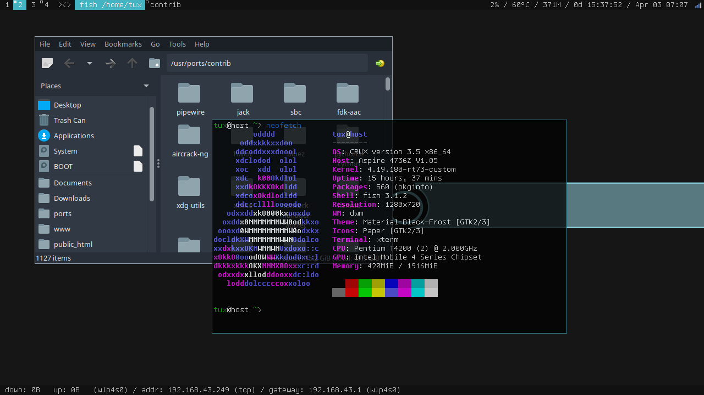

# dwm 6.1 (customized)
This is a dynamic window manager from suckless.org, with the following patches<sup id="a1">[[1]](#f1)</sup> applied:
* autoresize
* bottomstack
* center
* dualstatus
* [fancybarclickable](https://github.com/nggit/dwm-fancybarclickable-6.1)
* gaplessgrid
* pertag
* savefloats
* sticky
* systray
## Build and Install
```
$ make clean
$ make
# make install
```
Please note that dwm uses config.h or [config.def.h](config.def.h) for its configuration. Which configuration must be done prior to compilation.
## Starting dwm
You can use your favorite Display Manager / Login Manager, or append this line to your `~/.xinitrc`:
```
exec dwm
```
To launch an X session with ConsoleKit:
```
exec ck-launch-session dbus-launch --sh-syntax --exit-with-session dwm
```
## Usage
Basic Shortcuts:
| Keys                | Type    | Description                 |
|---------------------|---------|-----------------------------|
| ALT + F             | Layout  | Floating                    |
| ALT + G             | Layout  | Grid                        |
| ALT + M             | Layout  | Monocle (Maximized)         |
| ALT + T             | Layout  | Tile                        |
| ALT + P             | Command | dmenu Launcher              |
| ALT + SHIFT + ENTER | Command | Launch a terminal window    |
| ALT + SHIFT + SPACE | Command | Toggle floating on a window |
| ALT + SHIFT + C     | Command | Close a window              |
| ALT + SHIFT + Q     | Command | Quit dwm                    |
## Screenshot

##
<span id="f1">1. Some patches have been modified / fixed. [&#8617;](#a1)</span>
